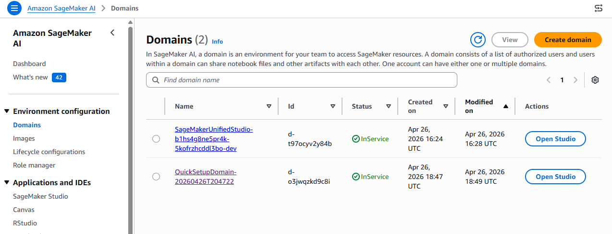
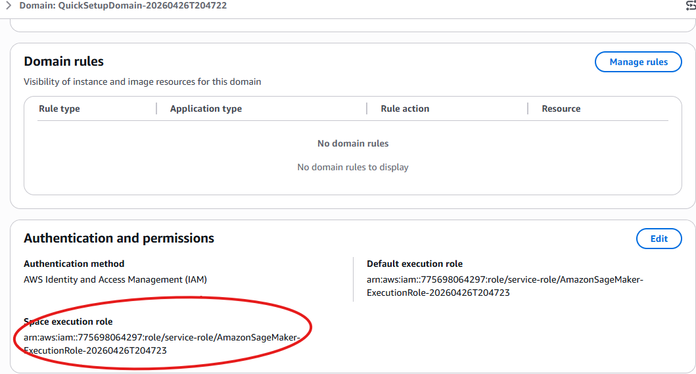
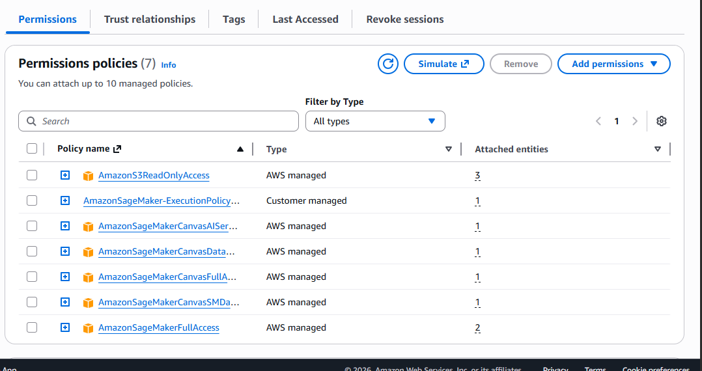

# News aggregator

# Download dataset

we will work on uci new dataset that you can download from this link : https://archive.ics.uci.edu/dataset/359/news+aggregator

# Upload dataset to S3

After unzipping the dataset you should create an S3 bucket and upload your dataset file on it

# Amazon SageMaker AI

go and create your domain on Amazon SageMaker AI and select `set up for single user`

# Set Up IAM Role

Go to your domain and get your doamin'role name

then go to your IAM service, search for the execution role of your domain 

click on it and add an `AmazonS3ReadOnlyAccess`

Before to start creating our jupyter file, you should chnage your instance type to one more powerful, for that go on Amazon sageMaker AI, select your domain 

il you don't already have one space create one by clicking on `JupyterLab` icon on top left, if you already have one click on it

Stop your instance, wait for it... and then upgrade instance type by choosing `ml.t3.2xlarge`

